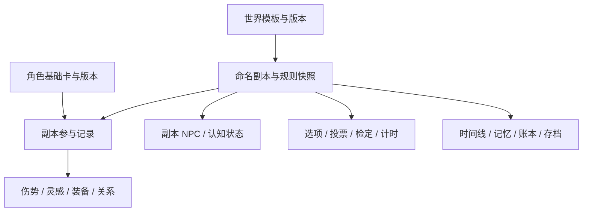
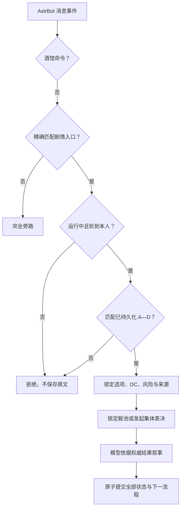
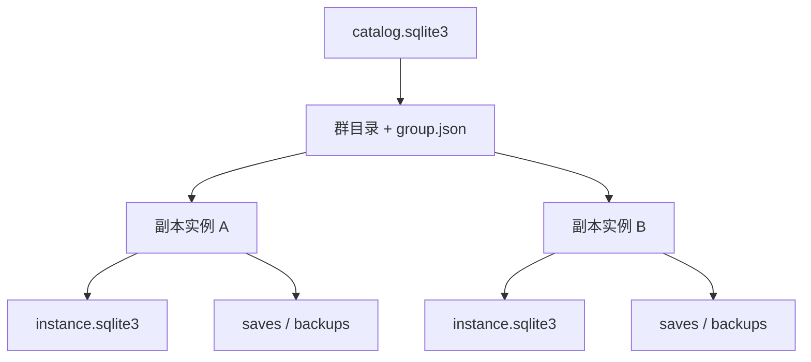

# v0.5.1 Alpha 架构与安全边界

## 对象分层

角色基础卡可版本化；伤势、灵感、装备次数、NPC 关系和临时成长只属于一个副本。动态 NPC 也只属于当前副本，不回写世界模板。

## 群消息处理链

管理命令只使用真实平台 `sender_id` 鉴权。昵称、群名片、引用文本和“我是管理员”等内容都不参与权限判断。

## 失败一致性与幂等

- 选项、投票、骰点、NPC 操作、时钟和世界事件都有稳定 ID。
- 检定操作回执在最终叙事前持久化；相同操作 ID 总是复用原骰池。
- 模型回退链共享同一份请求和权威检定结果。
- SQLite `BEGIN IMMEDIATE` 包裹剧情、角色运行值、NPC、记忆、账本、时钟、行动权和后续流程。
- 模型失败、结构无效或 revision 冲突时，不提交剧情事务。
- Bot 重载后恢复草稿、选项、投票、计时器和检定操作回执。
- 配置保存后回读校验，并用内容哈希去重记录修订。

## 状态机

| 状态 | 可做 | 不可做 |
|---|---|---|
| `closed` | 查看、选择、克隆 | 加入、建卡、剧情 |
| `preparing` | 加入、建卡、审核、准备、读档 | 剧情行动 |
| `running` | 四选一、投票、检定、存档 | 修改世界模板 |
| `paused` | 查看、调整、恢复准备 | 剧情行动、倒计时 |
| `finished` | 查看、导出、克隆 | 一切原副本写操作 |

`maintenance` 仅为历史兼容。0.5 的 `finished` 会与 `session_archives.readonly=1` 双重校验，不能转回准备或运行状态。

## 永久归档事务

完结或强制终止在同一事务中：

1. 建立最终保护存档。
2. 写入最终系统事件。
3. 取消活动选项、投票和计时。
4. 撤销代控、协助标记、返场流程和副本权限。
5. 解除当前群选择。
6. 写入结束类型、原因、操作者和时间。
7. 把副本改为永久只读。

克隆操作只读取源副本，并为目标副本重新分配 NPC、记忆和存档 ID。

## 权限

- 全局管理员：插件配置中的真实用户 ID。
- 主持人：创建或开启副本时授予。
- 秩序管理员：由主持人或管理台授予。
- 玩家：只控制本人角色；代控必须有持久化授权。
- 封禁分为副本、群和全局作用域，不能被投票绕过。

安全暂停不要求公开原因，任何活跃玩家都可触发。暂停会冻结个人回合、投票和其他活动计时器。

## 模型可写边界

模型只能提议：

- 受白名单限制的世界状态补丁
- 下一组 A/B/C/D 与集体决策
- 记忆候选和治理元数据
- 副本 NPC 的公开资料、认知与运行状态
- 伤势/状态、协助、剧情账本和场景时钟操作
- 返场任务推进

模型不能修改：

- 管理员、权限、封禁和会话阶段
- 世界模板和角色卡基础属性
- 已锁定骰点、DC、风险、优劣势和投票资格
- 存档指针、计时规则和配置修订
- NPC 的系统级私密提示词

未知字段会被丢弃。模型提出的优劣势必须匹配角色卡、运行状态、协助或已持久化场景事实。

## 检定

1. A—D 选项提前声明检定类型、属性、DC、风险和可见后果。
2. 模型第一阶段只能申请检定。
3. 插件读取已审核角色卡加值，并验证优劣势来源。
4. 插件按常规、优势、劣势、集体或对抗规则生成骰池。
5. 骰池和请求写入 `operation_receipts`。
6. 模型第二阶段只能依据权威结果叙事。
7. 最终事务保存骰点、来源、结果档位和状态操作。

同一原因不能同时提高 DC 和造成劣势。风险只决定失败后果，不改变成功概率。

## 结果档位

| 条件 | 结果 |
|---|---|
| 超出 DC 10 点以上或保留骰自然 20 | 大成功 |
| 达到 DC | 成功 |
| 低于 DC 1—4 点 | 代价成功 |
| 低于 DC 5—9 点 | 失败 |
| 低于 DC 10 点以上或保留骰自然 1 | 大失败 |

失败仍推进剧情。关键主线线索不能因一次失败永久消失。

## NPC 与记忆

- 世界常驻角色复制成 `session_characters`。
- 模型新建 NPC 默认待复核，并受单回合上限与登记原因校验。
- 同名/别名冲突保存为疑似重复提案。
- 只有活跃、近期相关且未拒绝的 NPC 进入模型上下文。
- NPC 陈述、谣言和误解与世界事实分开。
- 记忆支持锁定、置顶、可见范围、失效、冲突和替代关系。
- 锁定事实优先于普通上下文预算。

## 投票与多人回合

- 真实玩家一人一票，多角色不增加票数。
- 资格名单在投票建立时冻结。
- 第一轮无多数时前两名进入决选。
- 第二轮平票或参与不足则维持现状。
- 投票挂起个人计时，不消耗当前玩家行动。
- 投票结束后恢复同一行动者。
- 只有完整多人轮次结束时，才至多触发一次世界脉冲。

## 存档

Schema 5 的回合级快速恢复点除世界状态与时间线指针外，还包含：

- 角色卡引用和角色副本运行状态
- 参与、准备、候补、暂离和退场状态
- 多人轮次与行动权
- 未完成选项、投票、事件和计时器
- 权限、代控、封禁和返场任务
- 副本规则状态、动态 NPC、剧情账本、场景时钟和协助标记

读档前建立保护快照；读档后副本进入暂停。旧分支不删除，仍可审计与备份。

## 数据库与升级

- SQLite WAL、外键和 busy timeout。
- Schema 5 使用 `catalog.sqlite3` 协调全局目录和兼容事务。
- 每个群拥有稳定目录，每轮故事副本拥有带创建时间和唯一 ID 的独立目录。
- 每个副本持续物化为自包含 `instance.sqlite3`，并用 `manifest.json` 与 SHA-256 校验。
- 回合级恢复点保存在副本数据库内部；手动、最终和周期备份生成独立时间戳 ZIP。
- Schema 5 结构升级前用 SQLite backup API 生成一致备份。
- 备份失败时停止迁移。
- 0.4 `finished` 自动迁移为永久归档。
- Schema 1—4 JSON 备份可导入并补齐 0.5.1 状态。

目录关系：

详见 [升级与存档说明](UPGRADE_AND_SAVES.md)。

## Web 管理台

前端只使用 `window.AstrBotPluginPage` bridge；后端每个 API 检查 AstrBot Dashboard 登录态。页面不读取 Dashboard Cookie、LocalStorage 或父页面 DOM。群／副本检索在服务端分页；群备注使用 revision 防止并发覆盖；世界 JSON、角色卡模板和备份导入均有结构、Schema、大小与冲突校验。
